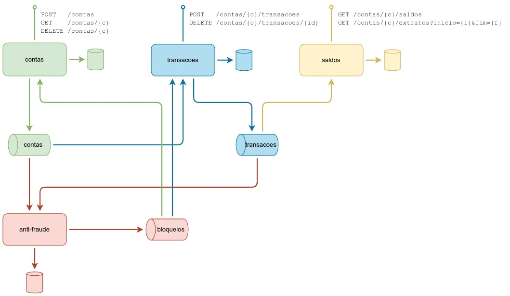

# PoC conta corrente

Exemplo utilizado para testar conceitos de [Event Driven Architeture](https://medium.com/@marcelomg21/event-driven-architecture-eda-em-uma-arquitetura-de-micro-servi%C3%A7os-1981614cdd45) e [CQRS](https://martinfowler.com/bliki/CQRS.html).
O exemplo usado é uma conta de banco com transações e validação de fraude.

## Design

## TODO

- ~~criar diagrama macro dos serviços~~
- ~~criar docker-compose com as tecnologias~~
- criar serviços
  - **contas** - APIs REST para criação, consulta e deleção de contas
    - ~~criar APIs~~
    - adicionar consumidor tópico de bloqueios
  - **transacoes** - APIs REST para criação e deleção de transações financeiras
  - **saldos** - APIs REST para consulta de saldo e extrato
  - **anti-fraude** - validação das transações para bloqueio ao identificar suspeitas
    - regra simples: 3 transações em menos de 1s gera bloqueio
