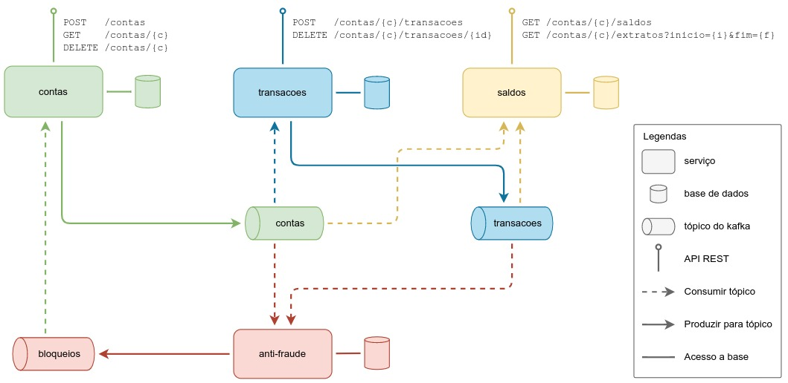

# PoC conta corrente

Exemplo utilizado para testar conceitos de [Event Driven Architeture](https://medium.com/@marcelomg21/event-driven-architecture-eda-em-uma-arquitetura-de-micro-servi%C3%A7os-1981614cdd45) e [CQRS](https://martinfowler.com/bliki/CQRS.html).
O exemplo usado é uma conta de banco com transações e validação de fraude.

## Design



## TODO

- ~~criar diagrama macro dos serviços~~
  - ~~ajustar diagrama macro dos serviços~~
- ~~criar docker-compose com as tecnologias~~
- criar serviços
  - **contas** - APIs REST para criação, consulta e deleção de contas
    - ~~criar APIs~~
    - adicionar consumidor tópico de bloqueios
  - **transacoes** - APIs REST para criação e deleção de transações financeiras
    - ~~criar consumidor tópico contas~~
    - ~~criar APIs de transações~~
    - adicionar validações de limites
      - ~~na criação~~
      - no estorno
  - **saldos** - APIs REST para consulta de saldo e extrato
  - **anti-fraude** - validação das transações para bloqueio ao identificar suspeitas
    - regra simples: 3 transações em menos de 1s gera bloqueio

# Utilização

Usando https://httpie.io/

## Contas

- criar conta
```shell
http :8090/contas titulares:='[{"documento":"1234","nome":"João"}]'
```

- listar conta
```shell
http :8090/contas/c87df74b-3269-4840-966d-3742bd912212
```

- deletar conta
```shell
http DELETE :8090/contas/c87df74b-3269-4840-966d-3742bd912212
```

## Transações

- criar um DEBITO
```shell
http :8091/contas/c87df74b-3269-4840-966d-3742bd912212/transacoes tipoTransacao=DEBITO valor=500.0 dataTransacao="2022-01-02" descricao="Saque" 
```

- criar um CREDITO
```shell
http :8091/contas/c87df74b-3269-4840-966d-3742bd912212/transacoes tipoTransacao=CREDITO valor=500.0 dataTransacao="2022-01-02" descricao="Depósito" 
```
